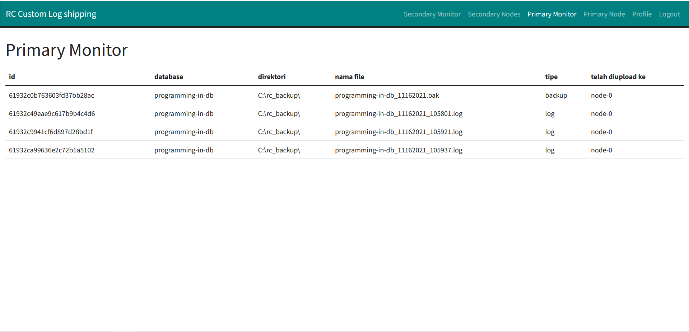

# Web monitoring custom log shipping

## Panduan Pemasangan

### Prerequisite

* [Git](https://git-scm.com/downloads)
* [NodeJs](https://nodejs.org/en/download/) versi v14 atau lebih tinggi
* [Yarn](https://classic.yarnpkg.com/lang/en/docs/install/) versi 1.22
* [MongoDB](https://www.mongodb.com/try/download/community) versi 5.0.3

### Mulai Pemasangan

1. Salin repositori

```bash
git clone https://github.com/rochimfn/tbd-server-webserver.git
```

2. Masuk ke direktori

```bash
cd tbd-server-webserver
```

3. Pasang dependensi

```bash
yarn 
```

4. Konfigurasi `.env`

```bash
cp .env.example .env #bash atau powershell
copy .env.example .env #cmd
```

Isi konfigurasi dengan kredensial mongodb dan token (random string). Contohnya sebagai berikut:

**Konfigurasi mongodb wajib sama dengan [backup script](https://github.com/rochimfn/tbd-backup-script)**
```env
MONGO_HOST='127.0.0.1'
MONGO_PORT='27017'
MONGO_DATABASE='log_shipping'
MONGO_USERNAME='admin'
MONGO_PASSWORD='password'
TOKEN='vmouwqhlkdjf0f29u0fh2vs'
```

5. Menyiapkan akun pengguna

```
yarn setup
```

Pengguna default:
  * Nama Lengkap: `Rochim Farul Noviyan`
  * Email: `rochim.noviyan@gmail.com`
  * Password: `password`

Akun pengguna dapat disesuaikan didalam pengaturan profile.


6. Jalankan web server


```
yarn start
```

Tunggu sebentar dan web monitoring akan dapat diakses melalui port 5000.

Server dapat dimatikan dengan menekan tombol `CTRL+C`

## Daftar Halaman

### Masuk

Kredensial:
* Email (default): `rochim.noviyan@gmail.com`
* Password (default): `password`


### Profile

Dihalaman ini anda dapat menyesuaikan nama lengkap, email dan password.


### Primary Node

Dihalaman ini anda dapat menyesuaikan koneksi ke primary node (hanya satu).


### Secondary Nodes

Dihalaman ini anda dapat menyesuaikan koneksi ke client secondary nodes (bisa lebih dari satu secondary).


### Primary Monitor

Dihalaman ini anda dapat memantau pengiriman ke client secondary nodes.



### Secondary Monitor

Dihalaman ini anda dapat memantau status restorasi terakhir di seluruh secondary nodes.

